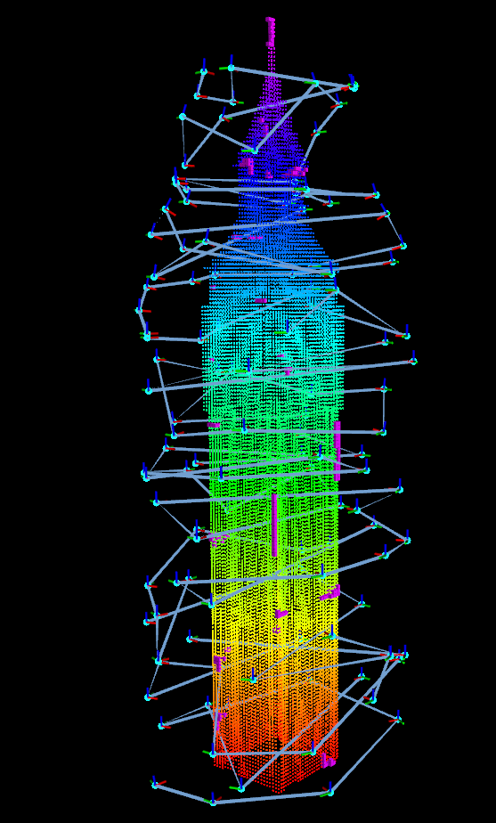
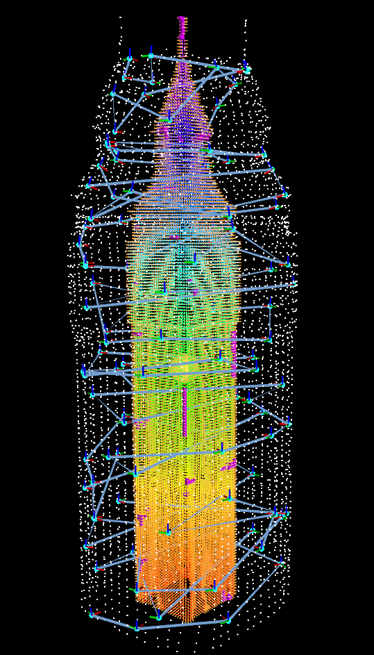
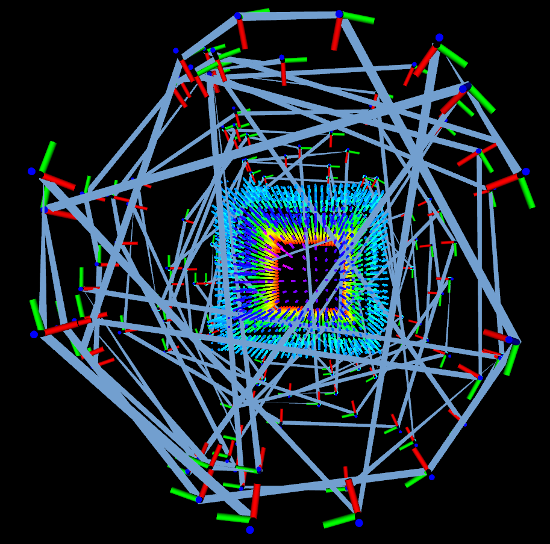
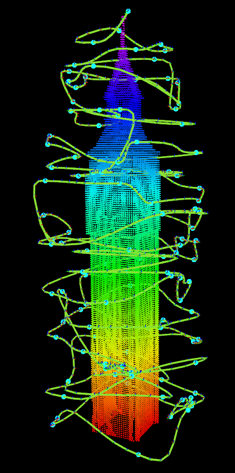
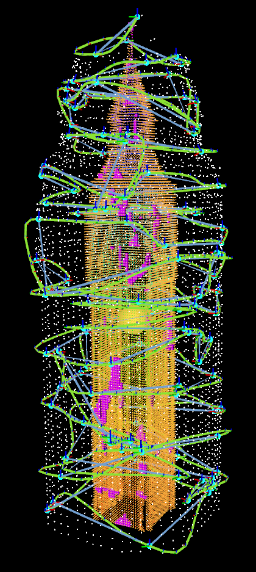
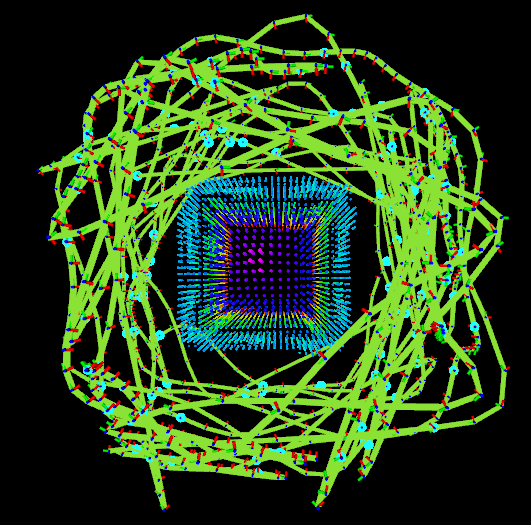
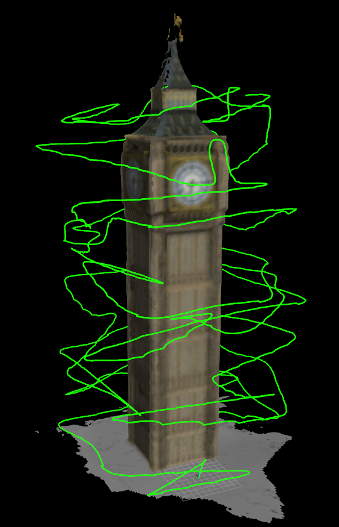

# CEO-MLCPP: Control Efficient and Obstacle-aware Multi-Layer Coverage Path Planner for 3D reconstruction with UAVs
+ The purpose of the algorithm is to inspect a known building with an UAV for 3D reconstruction. (Offline method)
+ International Conference on Robot Intelligence Technology and Applications (RiTA), 2022

<br>

#### Original MLCPP
+ TSP, not considering collision nor smoothness of paths
<p align="center">
  
  
  
  <br>
  <em>Original MLCPP. (left): Target and path. (center): full visualization. (right): collisions of path</em>
</p>

#### CEO-MLCPP
+ TSP considering collision and smooth, control-efficient paths
<p align="center">
  
  
  
  <br>
  <em>CEO-MLCPP. (left): Target and path. (center): full visualization. (right): path without collision</em>
</p>


<br>

## How to install
+ Install requirements: `ROS`, `Eigen`, `PCL`, `OpenCV`

+ Clone and built this repo
```bash
cd ~/<your_workspace>/src
git clone --recursive https://github.com/engcang/CEO-MLCPP.git

cd ~/<your_workspace>
catkin build -DCMAKE_BUILD_TYPE=Release
. devel/setup.bash
```

<br>

## How to run
+ Edit some parameters in `main.launch` file
```bash
roslaunch ceo_mlcpp main.launch
rostopic pub /calculate_cpp std_msgs/Empty
```
+ Warning message `Invalid argument passed to canTransform argument source_frame in tf2 frame_ids cannot be empty`
  + Just ignore it. It will disappear after `rostopic pub /calculate_cpp std_msgs/Empty`

<br>

---

## How to do real-time 3D reconstruction with the generated path in Gazebo
+ Install `PX4-SITL`
+ Install `Voxblox`
+ Setup `Gazebo` env

```bash
cd CEO-MLCPP
echo "export GAZEBO_MODEL_PATH=$GAZEBO_MODEL_PATH:$(pwd)/GAZEBO" >> ~/.bashrc
. ~/.bashrc
```

+ Build flight codes
```bash
cd ~/<your_workspace>
catkin build -DCMAKE_BUILD_TYPE=Release -DCEO_MLCPP_FLIGHT=True
. devel/setup.bash
```

+ Run
```bash
roslaunch ceo_mlcpp gazebo.launch
roslaunch ceo_mlcpp main.launch flight_with_gazebo:=true
rostopic pub /calculate_cpp std_msgs/Empty
```

### 3D reconstruction result
+ with `Voxblox`
<p align="center">
  
</p>

+ with `pix4D`